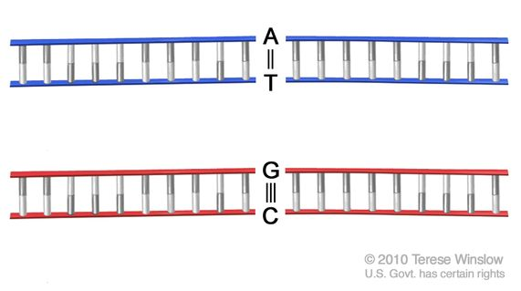
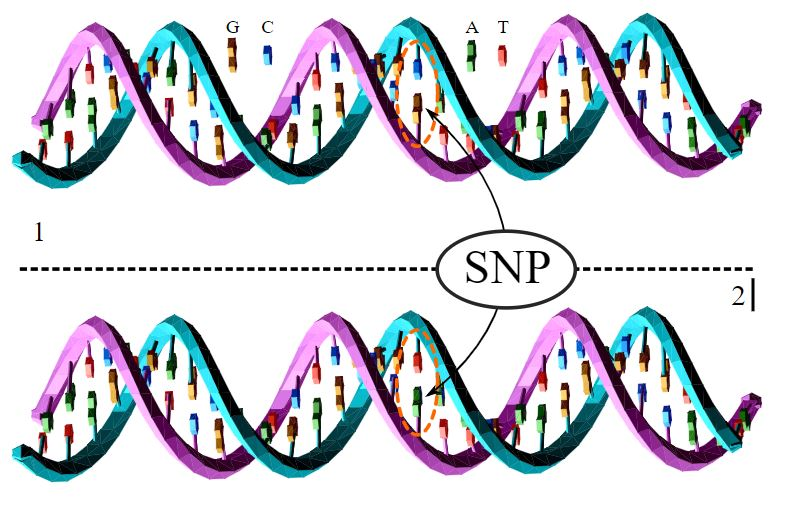
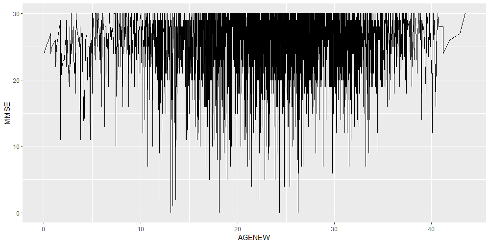
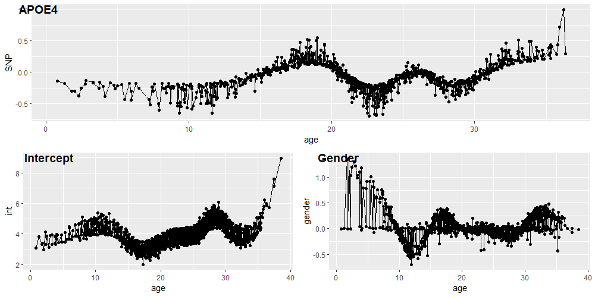
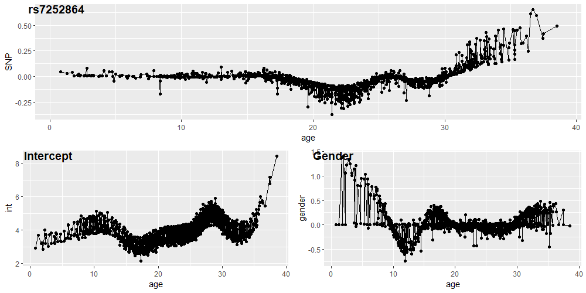

```{r setup, include=FALSE}
library(knitr)
library('tidyverse')

options(max.print="1000")
opts_chunk$set(echo    = FALSE,
	             cache   = TRUE,
               prompt  = FALSE,
               tidy    = TRUE,
               comment = NA,
               message = FALSE,
               warning = FALSE)
opts_knit$set(width = 100)


```


# Abstract

---

Alzheimer's disease (AD) is a serious neurodegenerative condition that affects millions of individuals across the world and the most common cause of dementia. As the average age of individuals in the world increases, the prevalence of AD will continue to grow. The Alzheimer’s Disease Neuroimaging Initiative (ADNI) unites researchers with study data as they work to define the progression of Alzheimer’s disease. ADNI researchers collect, validate, and utilize data, including MRI and PET images, genetics, cognitive tests, Cerebrospinal Fluid (CSF) and blood biomarkers as predictors of the disease. The genetic data from the Alzheimer's Disease Neuroimaging Initiative (ADNI) have been crucial in advancing the understanding of Alzheimer's disease (AD). 

The core element of ADNI genetic data is __single-nucleotide polymorphism (SNP)__, which is always coded by 3 values: 0, 1 and 2.  Considering the fact that the value of SNP does not change over time, we apply a screening procedure for varying coefficient models with ultrahigh dimensional longitudinal predictor variables, to find the __time-varying effects__ of SNPs in response variable Mini Mental State Examination (MMSE), which is a tool that can be used to systematically and thoroughly assess mental status.


# Introduction

## DNA bases 

DNA base pair is the molecules called nucleotides, on opposite strands of the DNA double helix, that form chemical bonds with one another. These chemical bonds act like rungs in a ladder and help hold the two strands of DNA together.

There are four nucleotides, or bases, in DNA: __adenine (A)__, __cytosine (C)__, __guanine (G)__, and __thymine (T)__. These bases form specific pairs (A with T, and G with C).

The human genome contains approximately __3 billion__ of these base pairs, which reside in the 23 pairs of chromosomes within the nucleus of all our cells.

```{r, out.width='50%', fig.align='center'}

```

## SNP

In genetics, a single-nucleotide polymorphism ( SNP, pronounced "snips") is a germline substitution of a single nucleotide at a specific position in the genome.

For example, at a specific base position in the human genome, the G nucleotide may appear in most individuals, but in a minority of individuals, the position is occupied by an A. This means that there is a SNP at this specific position, and the two possible nucleotide variations, G or A , are said to be the __alleles__ for this specific position.

SNPs occur normally throughout a person's DNA. They occur almost __once in every 1,000 nucleotides on average__, which means there are roughly __4 to 5 million SNPs__ in a person's genome.

## One SNP example

The upper DNA molecule differs from the lower DNA molecule at a single base-pair location (a G/A polymorphism)

```{r, out.width='50%', fig.align='center'}

```

## Genome-wide association study (GWAS)

One of main contributions of SNPs in clinical research is __genome-wide association study (GWAS)__. Gnome-wide genetic data can be generated by multiple technologies, including SNP array and whole genome sequencing.

GWAS has been commonly used in __identifying SNPs associated with diseases or clinical phenotypes or traits__. Since GWAS is a genome-wide assessment, a large sample site is required to obtain sufficient statistical power to detect all possible associations.

## Longitudinal Dataset

What is longitudinal dataset? \

A dataset is __longitudinal__ if it tracks the same type of information on the same subjects at multiple points in time. \

For example, part of a longitudinal dataset could contain specific students and their standardized test scores in six successive years.

```{r, out.width='90%', fig.align='center'}
knitr::include_graphics('./Figure/Intro_3.png')
```


# Data


## Patients' Information

In the ADNI1 dataset, we totally had __819__ patients.

```{r Patients Information}

## Original covariates
data_covariates0 <- read.csv("ADNI_Patient_Covariates.csv")
variable_list   <- c("RID", "VISCODE", "EXAMDATE","AGE","PTGENDER","MMSE", "APOE4")

data_covariates <- data_covariates0 %>%
  filter(ORIGPROT == "ADNI1") %>%
  dplyr::select(variable_list) 

patient_n = nrow(data_covariates %>% distinct(RID))
print(paste('Patient Number: ', patient_n, sep = ''))

colnames(data_covariates0)
```


## One patient genetic dataset 

There were __757__ patients who had genetic data among 819 patients. We picked one patient (RID:0413) as our example.

- SNPs (Rows)\
There are __620901__ SNPs (rows) for each patient.

- Variables (Columns)\
There are __24__ variables (columns) for each patient.


```{r, out.width='90%', fig.align='center'}
knitr::include_graphics('./Figure/Data_1.png')
```


---

We put the focus on following variables:  __"Allele1AB", "Allele2AB", "SNPName", "SNP", "Chromosome", "Position"__.

- Allele1AB means Allele 1 in A/B notation
- Allele2AB means Allele 2 in A/B notation
- Chr includes 26 typeS: 1-22, X, Y, XY, MT
- Position is the chromosomal position of the SNP
- SNP includes 8 types, "[T/C]", "[A/G]", "[C/G]", "[T/A]", "[G/C]", "[T/G]", "[A/C]" and "[A/T]".

Based one the column "Allele1AB" and "Allele2AB", the genotype for each SNP could be defined as:

$$
SNP = \begin{array}{cc}
  \{ & 
    \begin{array}{cc}
      0 & if \ GenoCode = AA \\
      1 & if \ GenoCode = AB \\
      2 & if \ GenoCode = BB \\
    \end{array}
\end{array}
$$


# Methods


## Background

The response $y_{i}(t)$ along with its covariate vectors {$z_{i}(t), x_{i}(t)$} at times $t_{ij}, j = 1, ⋯ , J_{i}$ where $J_{i}$ is the total number of observations from the ith subject [@chu2016feature]. 

- The covariate vector $z_{i}(t)$ is a low-dimensional predictor consisting of variables that are believed to impact the response based on empirical evidence or relevant theories. [@chu2016feature]

- The covariate vector $x_{i}(t)$ is ultrahigh dimensional and contains a vast number of covariates such as hundreds of thousands of SNPs. [@chu2016feature]


## General Model

It is believed that a relatively small number of x-variables have an impact on the response, and most of x-variables are likely to be irrelevant. To explore potential time-varying effects, we consider the following __time-varying coefficient model__. [@chu2016feature]

$$
\begin{equation}
y_{i}(t) = \beta_{0}(t)+\sum_{l=1}^{q}\beta_{l}(t)z_{il}(t)+\sum_{k=1}^{p}\gamma_{k}(t)x_{ik}(t) + \epsilon_{i}(t)
\end{equation}
$$
where $\beta_{l}(t), l = 0, ..., q$ and $\gamma_{k}(t), k = 1, 2,...,p$ are nonparametric smooth coefficient functions, and $\epsilon_{i}(t)$ is the error term with conditional mean $E[\epsilon_{i}(t)∣x_{i}(t), z_{i}(t)] = 0$. 


## General Model (Only consider one SNP)

For each $k$, we could define a marginal (a single x-variable) nonparametric regression model with the $k^{th}$ x-predictor: [@chu2016feature]

$$
\begin{equation}
y_{i}(t_{ij}) = \beta_{0k}^{*} +
\sum_{l=1}^{q}\beta_{lk}^{*}(t_{ij}) z_{il}(t_{ij}) +
\gamma_{k}^{∗}(t_{ij}) x_{ik}(t_{ij}) +
\epsilon_{t}^{*}(t_{ij})
\end{equation}
$$

where {$\beta_{lk}^{*}(t),l=0,1,…,q$} and $\gamma_{k}^{∗}(t)$ are __smooth coefficient functions__.


## Regression Spline Mothod

We could employ a $\underline{regression \ spline \ method}$  to estimate the coefficient functions and obtain the residuals [@chu2016feature]. Using cubic B-splines, we approximate {$\beta_{lk}^{*}(t),l=0,1,…,q$} and $\gamma_{k}^{∗}(t)$ as follows:

$$
\begin{equation}
\beta_{lk}^{*}(t) \approx \sum_{m=1}^{M_{ln}}\eta_{lm}B_{km}(t)\\
\gamma_{k}^{*}(t) \approx \sum_{h=1}^{L_{kn}}\theta_{kh}B_{kh}(t)
\end{equation}
$$

where {$B_{hm}(·), m = 1,..., M_{hn}$} is a set of __B-splines__ which may differ across $h$, and $M_{ln}$ and $L_{kn}$ are the numbers of basis functions used for $\beta_{lk}^{*}(t)$ and $\gamma_{k}^{*}(t)$ respectively. 

$$
\begin{equation}
y_{i}(t_{ij}) = \sum_{m=1}^{M_{0n}}\eta_{0m}B_{0m}(t) +
\sum_{l=1}^{q} \sum_{m=1}^{M_{ln}}\eta_{lm}B_{km}(t) z_{il}(t_{lj}) + \\
\sum_{h=1}^{L_{kn}}\theta_{kh}B_{kh}(t) x_{ik}(t_{ij}) +
\epsilon_{t}^{*}(t_{ij})
\end{equation}
$$

The error term $\epsilon_{t}^{*}(t_{ij})$ is assumed to be independent between subjects and correlated within subject. Moreover, the variance of $\epsilon_{t}^{*}(t_{ij})$ is assumed to be time-varying. 


# Application


## Response Variable (MMSE)

The Mini Mental State Examination (MMSE) is a tool that can be used to systematically and thoroughly assess mental status. During the MMSE, a health professional asks a patient a series of questions designed to test a range of everyday mental skills. The __maximum MMSE score is 30 points__. 

- A score of 20 to 24 suggests mild dementia, 
- 13 to 20 suggests moderate dementia, 
- less than 12 indicates severe dementia. 

The following plot is the trajectory of 819 patients with MMSE.

```{r, out.width='90%', fig.align='center'}

```


## How to Set Time Points

- Treat the smallest age of patients (ADNI1) as 0,
- Treat the age at baseline of each patient as its original age, then add the date difference over 365 to the original age as its new age.

```{r Patients Information 1}

## Original covariates
data_covariates <- read.csv("ADNI_Patient_Covariates.csv")
variable_list <- c("RID", "VISCODE", "EXAMDATE","AGE","PTGENDER","MMSE", "APOE4")
data_covariates <- data_covariates %>%
  filter(ORIGPROT == "ADNI1") %>%
  dplyr::select(variable_list) %>%
  drop_na(MMSE)


## Transformation
data_patient_ADNI1 <- data_covariates %>%
  mutate(EXAMDATE = as.numeric(as.Date(EXAMDATE, "%Y-%m-%d"))) %>%
  mutate(EXAMDATE = EXAMDATE - min(EXAMDATE)) %>%
  mutate(AGENEW   = AGE - min(AGE)) %>%
  mutate(GENDER   = if_else(PTGENDER == "Female",
                            true = 0,
                            false = 1))


data_patient_ADNI1 <- data_patient_ADNI1 %>%
  mutate(EXAMDATE2 = EXAMDATE/365) %>%
  group_by(RID) %>%
  mutate(AgeDiff   = EXAMDATE2 - min(EXAMDATE2)) %>%
  mutate(AGENEW    = AGENEW  + AgeDiff)


data_patient_ADNI1_AGE <- data_patient_ADNI1 %>% select("RID","VISCODE", "EXAMDATE", "AGE", "AGENEW") 

data_patient_ADNI1_AGE
```


## Dataset after Transformation

To satisfy the requirements of methods, we choose the patients whose longitudinal __observations number between 4 and 6__. After transformation, there are 399 patients and 1935 longitudinal observations remaining.

```{r Patients Information 2}
data_patient_ADNI1 %>% 
  group_by(RID) %>% summarise(n = n()) %>% 
  group_by(n) %>% summarise(count = n())

## RID selection
data_patient_ADNI1_id <- data_patient_ADNI1 %>% 
  group_by(RID) %>% summarise(n = n()) %>% 
  filter(n <= 6) %>%
  filter(n >= 4) 


data_patient_ADNI1  <- data_patient_ADNI1 %>%
  filter(RID %in% data_patient_ADNI1_id$RID)

data_patient_ADNI1  <- data_patient_ADNI1 %>% select("RID", "VISCODE", "EXAMDATE","AGE", "AGENEW", "GENDER","MMSE") 

patient_n2 <- length(unique(data_patient_ADNI1$RID))
print(paste('Patient Number: ', patient_n2 , sep = ''))

data_patient_ADNI1

```


```{r Patients Information 3}

ggplot(data_patient_ADNI1, aes(x = AGENEW, y = MMSE)) + 
  geom_line()

```


## Model

We set the age of the $i^{th}$ subject at the $j^{th}$ measurements to be the time variable $t_{ij}$, and consider the following model

$$
MMSE_{i}(age_{ij}) = \beta_{0}(age_{ij})+
\beta_{1}(age_{ij})Gender_{i} + \\
\sum_{k=1}^{p}\gamma_{k}(age_{ij})SNP_{ik} +
\epsilon_{i}(age_{ij})
$$

where $Gender_{i}$ is the baseline predictor, and $SNP_{ik}$ are the SNP variables. Throughout this empirical analysis, it is assumed that $\epsilon_{i}(age_{ij})$ is a Gaussian process with mean zero and variance $Var[\epsilon_{i}(age_{ij})] = V(age_{ij})$, a smoothing function of age.


## Results1 (AOPE4)

```{r, out.width='100%', fig.align='center'}

```


## Results2 (rs7252864)

```{r, out.width='100%', fig.align='center'}

```


# Discussion

---

- The methodology allows for time-varying SNP effects which revealed that many seem to fundamentally change as Alzheimer's Disease patients' age.

- Not only the age of Alzheimer's Disease patients could be included, but also we could consider the status of Alzheimer's Disease patients: NL(Normal), MCI(Mild cognitive impairment) and AD.

- There are a number of ways in which this methodology can be expanded. One is allowing the $\epsilon_{i}(age_{ij})$ do not follow the naive Gaussian process, more complicated correlation structure could be considered, such as AR(1). Another useful generalization would be to allow for more estimation procedures for the time-varying coeffcients, such as Bayesian method, etc. 


# Acknowledgement

---

Data collection and sharing for this project was funded by the ADNI(National Institutes of Health Grant U01 AG024904) and DOD ADNI (Department of Defense award number W81XWH-12-2-0012). ADNI is funded by the National Institute on Aging, the National Institute of Biomedical Imaging and Bioengineering, and through generous contributions from the following: AbbVie, Alzheimer’s Association; Alzheimer’s Drug Discovery Foundation; Araclon Biotech; BioClinica, Inc.; Biogen; Bristol-Myers Squibb Company; CereSpir, Inc.; Cogstate; Eisai Inc.; Elan Pharmaceuticals, Inc.; Eli Lilly and Company; EuroImmun; F. Hoffmann-La Roche Ltd and its affiliated company Genentech, Inc.; Fujirebio; GE Healthcare; IXICO Ltd.; Janssen Alzheimer Immunotherapy Research \& Development, LLC.; Johnson \& Johnson Pharmaceutical Research \& Development LLC.; Lumosity; Lundbeck; Merck \& Co., Inc.; Meso Scale Diagnostics, LLC.; NeuroRx Research; Neurotrack Technologies; Novartis Pharmaceuticals Corporation; Pfizer Inc.; Piramal Imaging; Servier; Takeda Pharmaceutical Company; and Transition Therapeutics. The Canadian Institutes of Health Research is providing funds to support ADNI clinical sites in Canada. Private sector contributions are facilitated by the Foundation for the National Institutes of Health (www.fnih.org). The grantee organization is the Northern California Institute for Research and Education, and the study is coordinated by the Alzheimer’s Therapeutic Research Institute at the University of Southern California. ADNI data are disseminated by the Laboratory for Neuro Imaging at the University of Southern California. A special thanks to Danielle J Harvey for her support in helping us navigate the ADNI database.


# Reference

---

---
nocite: '@*'
---

